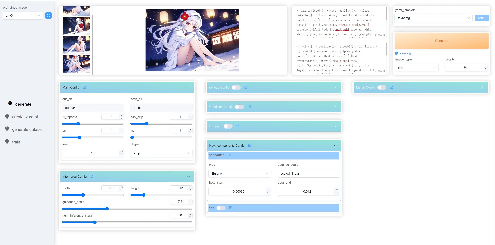
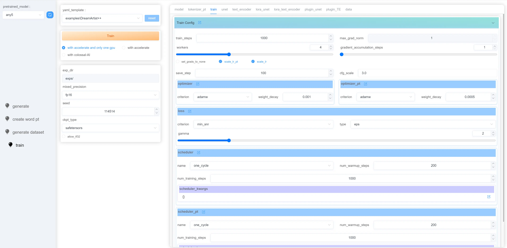

# HCP Diffusion web UI

一个基于Vue.js和Flask的HCP Diffusion图形界面




## 在 Windows 下安装

### 准备
1. 安装 [Python 3.10.6](https://www.python.org/downloads/release/python-3106/) (不支持python 3.11), 需要把Python添加到环境变量中 "Add Python to PATH".
2. 安装 [git](https://git-scm.com/download/win).
3. 安装 [node.js](https://nodejs.org/en/download) (>= 14.0.0).

### 下载 HCP Diffusion 与 webui
```bash
git clone https://github.com/7eu7d7/HCP-Diffusion-webui.git
cd HCP-Diffusion-webui
git clone https://github.com/7eu7d7/HCP-Diffusion.git
```

### 自动安装并启动
点击运行`webui-user.bat`


## 在 Linux 下安装

### 安装依赖:

```bash
# Debian-based:
sudo apt install wget git python3 python3-venv nodejs
# Red Hat-based:
sudo dnf install wget git python3 nodejs
# Arch-based:
sudo pacman -S wget git python3 nodejs
```

### 下载 HCP Diffusion 与 webui
```bash
git clone https://github.com/7eu7d7/HCP-Diffusion-webui.git
cd HCP-Diffusion-webui
git clone https://github.com/7eu7d7/HCP-Diffusion.git
```

### 自动安装并启动
```bash
bash webui.sh
```

可以在 `webui-user.sh` 中配置选项

## 使用说明

+ 把`diffusers`格式的模型放到`sd_models/`文件夹中便可以被加载。
+ `ckpts/`文件夹放训练好的`lora`或`part(微调的模型)`。
+ 生成图片和对应的配置文件输出到`output/`中。